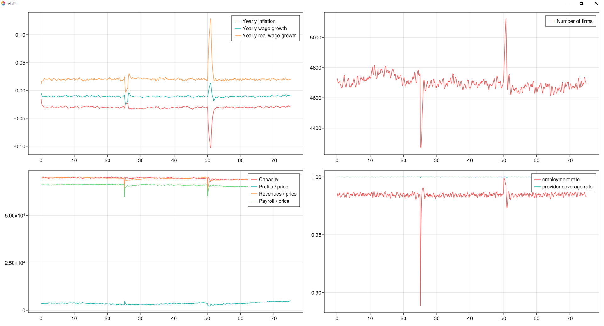

# Agent based macroeconomic model
Based on Stephensen 2022 https://github.com/PeterStephensen/dream.agentbased.SOE

## First draft
This first version contains a single production sector, and no monetary policy or financial system - i.e. the monetary base is fixed and productivity growth leads to deflation.

Approximately 50,000 households and 5,000 firms are simulated on a monthly basis.

The plots below show responses to first a firm destruction shock where 10% of firms are suddenly closed, second, a productivity shock where the productivity of all firms increases 10 % overnight.
