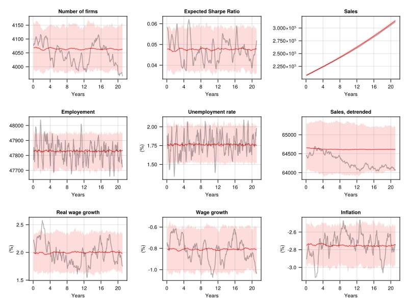
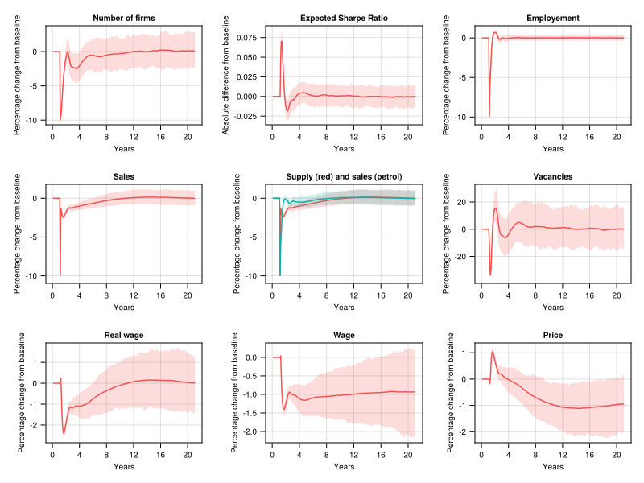
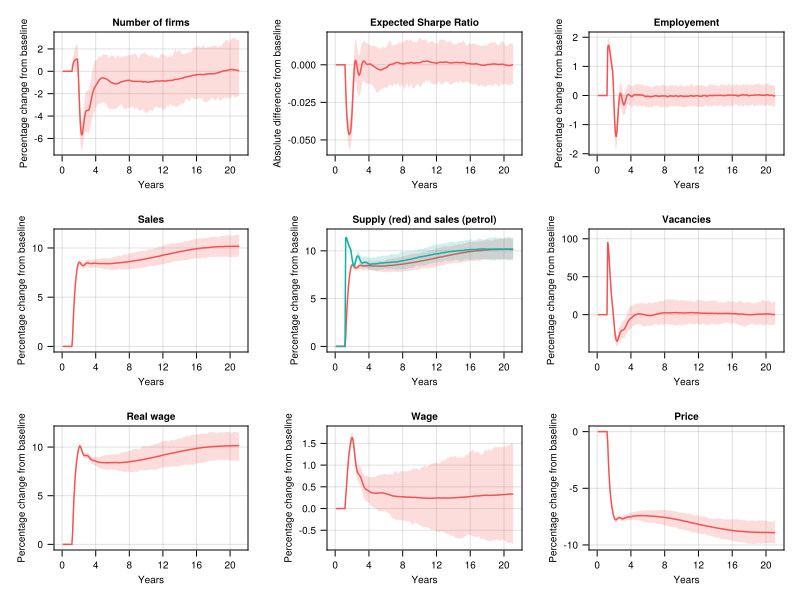

# Agent based macroeconomic model
Based on Stephensen 2022 https://github.com/PeterStephensen/dream.agentbased.SOE

## First draft
This first version contains a single production sector, and no monetary policy or financial system - i.e. the monetary base is fixed and productivity growth leads to deflation.

Approximately 50,000 households and 5,000 firms are simulated on a monthly basis.

## Baseline
The following plots show the baselines of 300 simulations. The red line is the mean value and shaded areas indicate the 95% confidence intervals. The result of single simulation is shown in gray as an example.

## Firm destruction shock
Below we show responses to a firm destruction shock where 10% of firms are suddenly closed

## Firm productivity shock
Next, responses to a productivity shock where the productivity of all new firms are 10% higher:

